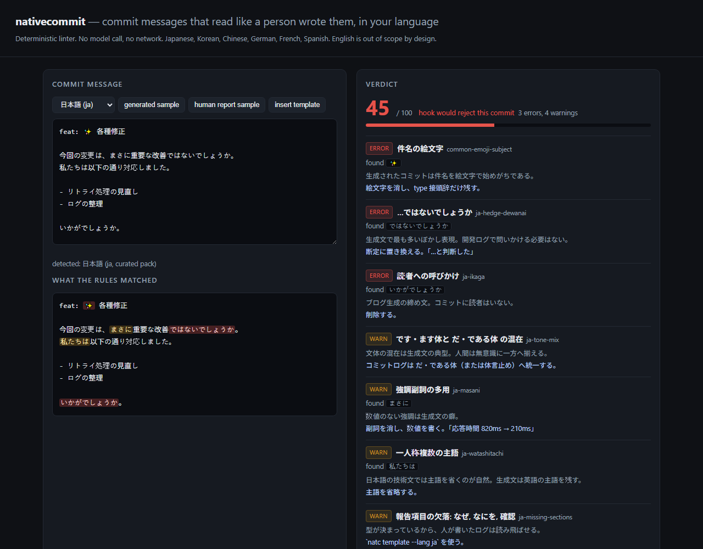
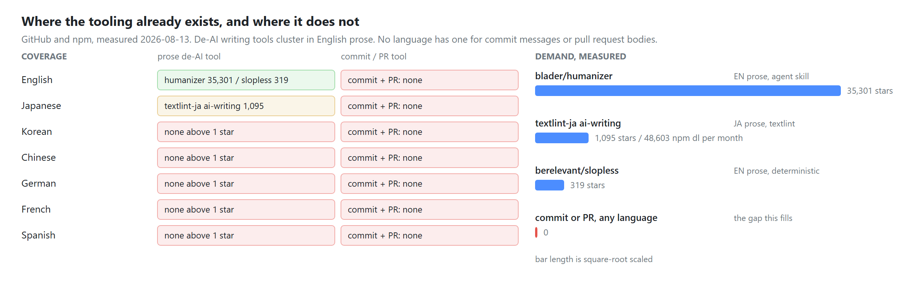
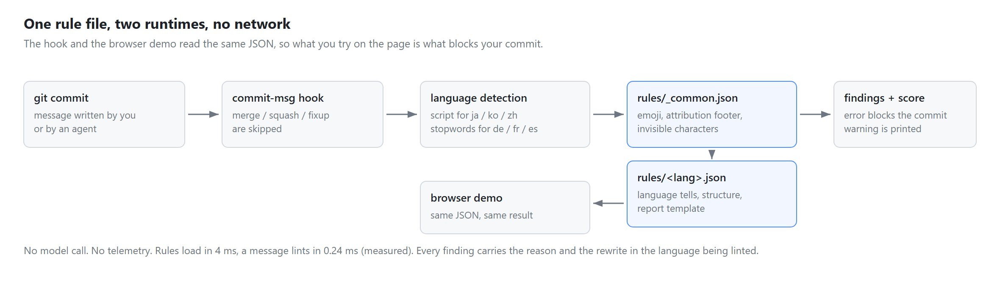

# nativecommit

Commit messages that read like a person wrote them, in your language.

`natc` is a deterministic linter for commit messages and pull request bodies in
**Japanese, Korean, Chinese, German, French and Spanish**. It rejects the writing
habits that mark a message as machine written, and it pushes every message into the
same short report shape: why, what, verified.

No model call. No network. No dependencies.

**English is out of scope on purpose.** That side is well served already; see
[blader/humanizer](https://github.com/blader/humanizer) and
[berelevant-ai/slopless](https://github.com/berelevant-ai/slopless).

Live demo: <http://118.130.18.231:8500/nativecommit/>



---

## Why this exists

Tooling for stripping AI tells is almost entirely English prose. Nothing targets the
one surface every engineer writes every day, in their own language: the commit log.



Measured 2026-08-13 through the GitHub search API and the npm registry. The queries are
in [`docs/gen_docs.py`](docs/gen_docs.py).

The tells do not translate. English advice about em dashes and the word *delve* does
nothing for a Japanese log that ends in `〜ではないでしょうか`, or a Korean one that
opens with `다음과 같습니다`. Each language needs its own list, written by people who
speak it.

## Install

```bash
pip install nativecommit
natc hook install --lang ja     # writes .git/hooks/commit-msg
```

That is the whole setup. The next commit with a generated-looking message is rejected
before it lands.

```bash
$ git commit -m "feat: 各種修正"
日本語  score 88/100  errors 1  warnings 0
  [ERROR] L1 何を変えたか分からない件名  (ja-vague-verb)
         found: feat: 各種修正
         why:   「各種修正」は差分を読めば分かることしか言っていない。
         fix:   対象と結果を書く。「決済リトライの上限を3回に変更」
```

Every reason and every rewrite is printed in the language being linted, not in English.

`hook install --lang ja` also runs `git config natc.lang ja`, so plain `natc lint` picks
the same pack later. Pinning matters: a kanji-only Japanese subject such as `各種修正`
carries no kana, and script detection alone reads it as Chinese.

## Use it without the hook

```bash
natc lint .git/COMMIT_EDITMSG          # file
natc lint -m "fix: 개선" --lang ko      # string
git log -1 --format=%B | natc lint     # stdin
natc lint -m "..." --json              # machine readable, exit 1 on error
natc template --lang ja                # print the commit template
natc template --lang ja --pr           # print the pull request template
natc langs                             # list packs
natc selftest                          # run the built-in checks
```

Exit code is 1 when any `error` level rule fires, 0 otherwise. Warnings are printed and
let through, so the hook stays usable on day one.

## The report shape

Rules alone only remove things. The template is what makes the result look like a person
reporting, and it is the same three questions in every language.

| language | subject | body |
|---|---|---|
| ja | `fix: 決済リトライの上限を3回に変更` | `なぜ:` / `なにを:` / `確認:` |
| ko | `fix: 결제 재시도 상한 3회로 변경` | `왜:` / `무엇:` / `확인:` |
| zh | `fix: 支付重试上限改为 3 次` | `为什么:` / `改动:` / `验证:` |
| de | `fix: Zahlungswiederholungen auf drei begrenzt` | `Warum:` / `Was:` / `Geprüft:` |
| fr | `fix: limite des tentatives de paiement fixée à trois` | `Pourquoi:` / `Quoi:` / `Vérifié:` |
| es | `fix: limite de reintentos de pago fijado en tres` | `Por qué:` / `Qué:` / `Verificado:` |

A body that has two or more lines but skips these sections is a warning, not an error.
One-line commits stay one-line commits.

## What it catches

Shared across every language (`rules/_common.json`): emoji in the subject, AI attribution
footers such as `Co-Authored-By: Claude`, zero-width watermark characters, markdown
headings and bold in a commit body, dividers, exclamation marks.

Per language, the tells are specific:

| language | rules | examples |
|---|---:|---|
| Japanese | 14 | `〜ではないでしょうか` · `と言っても過言ではない` · `いかがでしょうか` · `単なる〜ではなく` · です・ます体 と だ・である体 の混在 |
| Korean | 14 | `~인 것 같습니다` · `다음과 같습니다` · `함께 살펴보겠습니다` · `단순히 ~가 아니라` · 종결어미 혼용 |
| Chinese | 8 | `首先…其次…最后` · `值得注意的是` · `不仅…而且` · `希望对您有所帮助` |
| German | 7 | `Es ist wichtig zu beachten` · `In der heutigen digitalen Welt` · `nicht nur … sondern auch` |
| French | 8 | `Il est important de noter` · `Dans le monde d'aujourd'hui` · `non seulement … mais aussi` |
| Spanish | 8 | `Es importante destacar que` · `En el mundo actual` · `no solo … sino también` |

Plus structural checks per language: subject width in display columns, trailing period,
bullet floods, missing report sections, and mixed sentence endings.

Japanese and Korean packs are marked `curated`. The other four are `starter`: the obvious
tells are there, a native speaker will find more. That is the contribution this project
wants most.

## How it works



Rules are plain JSON. The CLI and the browser demo load the same files, so the page
cannot drift away from what the hook enforces.

```json
{
  "id": "ko-geot-gatda",
  "severity": "error",
  "weight": 10,
  "scope": "any",
  "pattern": "(?:인|한|된|하는|되는)\\s*것\\s*같(?:습니다|다|아요)",
  "title": "…인 것 같습니다",
  "why": "이미 실행한 변경에 추측형은 모순이다.",
  "fix": "확인한 사실로 바꾼다. 확인 못 했으면 '미확인'이라고 쓴다."
}
```

`scope` is `subject`, `body` or `any`. `severity` is `error` (blocks) or `warn` (prints).
`weight` is subtracted from a 100 point score. Nothing else.

## Add your language

1. Copy `natc/rules/de.json` to `natc/rules/<code>.json`.
2. Fill in `detect` (a script range, or a dozen stopwords for a Latin-script language).
3. Write the `template`: subject line plus the three questions in your language.
4. Add rules. Ten good ones beat fifty guesses. `why` and `fix` go in your language.
5. Run `python -m natc selftest`, then open a pull request.

The same file is picked up by the CLI and the demo page automatically. Localising
`rules/_common.json` for your language is a separate, smaller pull request: add an
`i18n` block to each rule.

## Scope

Deliberately not included:

- **English rules.** Covered elsewhere, and covering it would dilute the point.
- **Automatic rewriting.** A regex that rewrites natural language damages meaning when it
  misfires. `natc` reports the fix and lets you write it.
- **Model calls.** A commit hook that needs a network round trip and an API key is a
  commit hook people uninstall.

## Development

```bash
git clone https://github.com/<you>/nativecommit
cd nativecommit
python -m natc selftest        # 68 rules, 7 packs
python docs/gen_docs.py        # rebuild the README figures
python docs/build_web.py       # copy the rule packs next to web/index.html
python -m http.server -d web   # open http://localhost:8000/
```

`docs/build_web.py --out <dir>` also publishes the demo anywhere else. The rule packs are
never duplicated in the repository: the CLI ships them, the page borrows them.

## Prior art

- [textlint-ja/textlint-rule-preset-ai-writing](https://github.com/textlint-ja/textlint-rule-preset-ai-writing) — Japanese AI writing patterns for textlint prose. Proof the demand is real: 48,603 npm downloads per month.
- [blader/humanizer](https://github.com/blader/humanizer) — English, agent skill.
- [berelevant-ai/slopless](https://github.com/berelevant-ai/slopless) — English, deterministic textlint rules.

`natc` differs on two axes: it targets git surfaces rather than prose, and it starts from
languages other than English.

## License

MIT
