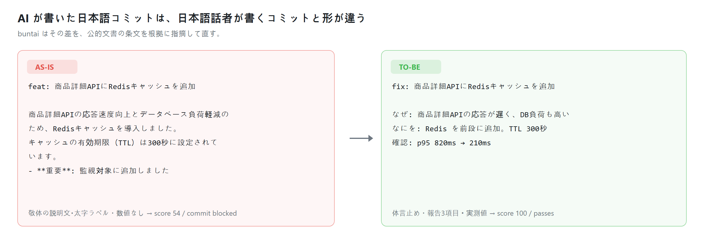
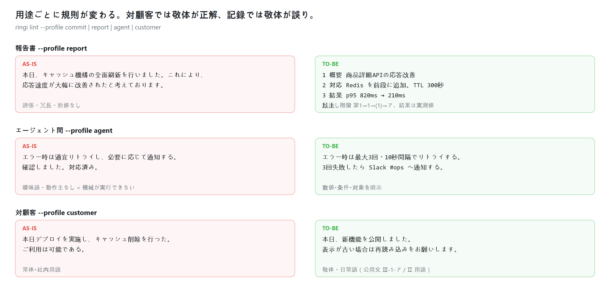
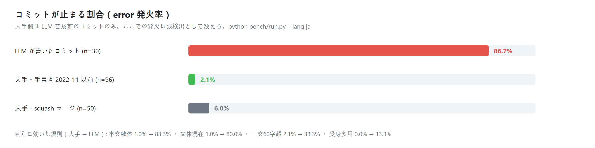
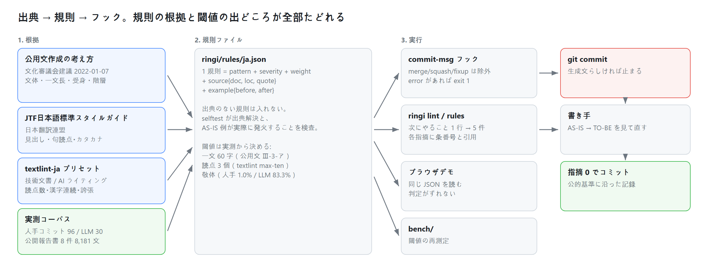

# buntai 文体

    

**その日本語、AI が書いた文体になっていませんか。**
報告書・エージェント間の受け渡し・対顧客の文面を、公的文書の条文を根拠に検査する決定論リンター。

日本語 校正 / 日本語 リンター / AI 文章 判定 / コミットメッセージ 日本語 / Python 製・Node.js 不要・textlint の代替または併用。

モデル呼び出しなし・ネットワークなし・依存パッケージなし ・ **[デモを開く](https://aidenlee0011.github.io/buntai/)**



```bash
pip install buntai-lint
buntai hook install --lang ja        # コミット
buntai lint report.md --profile report      # 報告書
buntai lint task.md   --profile agent       # エージェント間の受け渡し
buntai lint notice.md --profile customer    # 対顧客の文面
```

---

## 用途は 4 つ。用途が変われば正解も変わる

対顧客では敬体が正解、記録では敬体が誤り。同じ文が用途によって合格にも不合格にもなるため、用途は推測せず `--profile` で明示する。



| プロファイル | 対象 | 主な検査 |
|---|---|---|
| `commit` | コミット・PR（記録） | 常体・体言止め、件名で内容がつかめるか、報告 3 項目 |
| `report` | 社内報告書 | 見出し階層（第1 → 1 → （1） → ア）、文体の統一、誇張と冗長 |
| `agent` | エージェント間の受け渡し | 曖昧語の禁止（適宜・随時・必要に応じて）、動作主の明示 |
| `customer` | 対顧客の文面 | 敬体の強制、社内用語の言い換え、AI 特有の誇張の除去 |

---

## なぜ効くのか（実測）

AI が書いた日本語の本文は、ほぼ必ず「です・ます体の説明文」になる。日本語話者が書く記録は常体か体言止めである。感覚ではなく数えられる差である。



| 指標 | 人手コミット（2022-11 以前・96 件） | LLM 生成（30 件） |
|---|---:|---:|
| 本文が敬体 | 1.0% | **83.3%** |
| 文体（常体・敬体）の混在 | 1.0% | 80.0% |
| 一文 60 字超 | 2.1% | 33.3% |
| 受身形の多用 | 0.0% | 13.3% |
| **拒否（error 発火）** | **2.1%** | **86.7%** |

人手側は LLM が普及する前（2022 年 11 月以前）のコミットだけを集めているため、ここでの発火は誤検出として数える。

```bash
python bench/run.py --lang ja --rules
```


### 誤検出はどれくらいか

規則を増やすほど誤検出は増える。そこで**人が書いた本物の文章に対する発火率**を測っている。

| 検査対象（すべて人が書いた文章） | プロファイル | error 発火 |
|---|---|---:|
| コミット 96 件（2022-11 以前） | commit | **2.1%** |
| 公開報告書の本文 400 ブロック（JPCERT/CC） | report | **2.2%** |
| 同上（わざと誤ったプロファイルで検査） | commit | 96.8% |

用途に合ったプロファイルなら、人の文章はほぼ素通りする。用途を取り違えると全部止まる。だから `--profile` は推測せず明示する。

---

## 強み: 規則に出典がある

**すべての規則が、日本語の公的文書または実測コーパスに紐づく。** 作者の感覚で作った規則は 1 件も入っていない。出典を示せない信号は規則にせず、指標として出すだけにとどめている。

| 出典 | 発行 | 使っている箇所 |
|---|---|---|
| [公用文作成の考え方（文化審議会建議）](https://www.bunka.go.jp/seisaku/bunkashingikai/kokugo/hokoku/pdf/93651301_01.pdf) | 文化審議会・2022-01-07 | 文体の選択、一文の長さ、受身、二重否定、同じ助詞の連続、項目の階層、用語の言い換え |
| [JTF日本語標準スタイルガイド（翻訳用）](https://www.jtf.jp/pdf/jtf_style_guide.pdf) | 日本翻訳連盟 | 見出しは常体または体言止め、和文の句読点、半角カタカナ |
| [textlint-rule-preset-ja-technical-writing](https://github.com/textlint-ja/textlint-rule-preset-ja-technical-writing) | textlint-ja | 弱い表現、冗長表現、読点の数、漢字の連続 |
| [textlint-rule-preset-ai-writing](https://github.com/textlint-ja/textlint-rule-preset-ai-writing) | textlint-ja | 誇張表現、太字ラベルの箇条書き、コロン継続 |
| 公開報告書コーパス（JPCERT/CC 活動報告 8 件・8,181 文） | 実測 | 報告書テンプレートの文末（体言止め 44.7%・敬体 20.6%・常体 1.6%） |

指摘には必ず条番号と原文引用が付く。

```
$ buntai lint --profile customer notice.md
next: 敬体に直す。「変更した。」→「変更しました。」
日本語 / 対顧客の文面  score 80/100  errors 1  warnings 1  [blocked]
1. [ERROR] L2 対顧客の文面が常体  → 敬体に直す
     found: する。
     src:   公用文作成の考え方（文化審議会建議） Ⅲ-1-ア 文体の選択
     rule:  ja-customer-plain-form
2. [warn ] L2 社内用語がそのまま出ている  → 「デプロイしました」→「新しい機能を公開しました」
     src:   公用文作成の考え方（文化審議会建議） Ⅱ 用語の使い方
```

---

## しくみ



規則は JSON である。CLI とブラウザデモが同じファイルを読むため、デモで試した結果とフックの判定はずれない。

```json
{
  "id": "ja-customer-plain-form",
  "severity": "error",
  "profiles": ["customer"],
  "pattern": "(?:である|だ|した|する|ない)。",
  "title": "対顧客の文面が常体",
  "fix": "敬体に直す。「変更した。」→「変更しました。」",
  "example": {
    "before": "メンテナンスのため、9月1日にサービスを停止する。",
    "after":  "メンテナンスのため、9月1日にサービスを停止します。"
  },
  "source": {
    "doc": "koyobun", "loc": "Ⅲ-1-ア 文体の選択",
    "quote": "通知、依頼、照会、回答など、特定の相手を対象とした文書では敬体（です・ます体）を用いる。"
  }
}
```

`source` のない規則は受け付けない。selftest が全規則について出典の解決と、AS-IS 例が実際にその規則を発火させることを検査する。

---

## 使い方

```bash
buntai lint .git/COMMIT_EDITMSG        # ファイル
buntai lint -m "fix: 各種修正"          # 文字列
git log -1 --format=%B | buntai lint   # 標準入力
buntai lint report.md --profile report --json   # 機械可読
buntai rules --lang ja                 # 全規則 + 出典 + AS-IS/TO-BE
buntai metrics -m "..."                # 定量指標をコーパス実測値と並べる
buntai template --lang ja              # コミット / PR / 報告書テンプレート
python -m buntai selftest              # 77 規則 / 7 パック
```

error があると exit 1、warning は表示のみ。merge・squash・fixup は対象外。出力は既定 5 件まで、1 行目が次にやること、全件は `--all`。既定のプロファイルは `git config buntai.profile report` のように固定できる。

## 報告書テンプレート

項目の階層は公用文作成の考え方 Ⅱ-6-ウ の順序に従う。文末は公開報告書の実測分布に合わせ体言止めを既定とする。

```
件名: {内容}について（報告）

1 概要      {結論を1文・体言止め}
2 背景      {なぜ着手したか}
3 対応      (1) {実施事項} (2) {実施事項}
4 結果      {実測値。数値を必ず入れる}
5 今後の対応 {次の一手を1件}

以上
```

## 対応言語

日本語（出典付き・実測済み）が主対象。韓国語・中国語・ドイツ語・フランス語・スペイン語は初期版の規則のみで、出典整備はこれから。**英語は対象外**とし、既存ツールに委ねている。

## 貢献

1. 日本語の規則追加には `source`（文書名・条番号・引用）と `example`（AS-IS / TO-BE）が必須。
2. 他言語は `buntai/rules/<code>.json` を追加し、その言語の公的文書・業界標準を出典にする。
3. `python -m buntai selftest` が通ること。

## ライセンス

MIT。出典は条番号と短い引用のみを掲載し、原文の再配布は行っていない。

<br>

---

<br>

# English

**Does this Japanese text read like a machine wrote it?**

`buntai` (文体, writing style) is a deterministic linter for Japanese
reports, agent-to-agent handoffs, customer-facing copy and commit messages. Every rule cites a
Japanese public standard. No model call, no network, no dependencies, no API cost. [Live demo](https://aidenlee0011.github.io/buntai/).

```bash
pip install buntai-lint
buntai lint notice.md --profile customer
```

## Four profiles, because the correct style flips

| profile | target | checks |
|---|---|---|
| `commit` | commits and pull requests | plain form, informative subject, why/what/verified |
| `report` | internal reports | heading hierarchy, one sentence style, no hype |
| `agent` | machine-to-machine handoff | no vague terms, explicit actor, numeric conditions |
| `customer` | customer-facing text | polite form required, internal jargon rewritten |

Polite form is an error in a commit record and required in a customer notice. The profile is
explicit rather than guessed.

## Why it works

A Japanese body written by an LLM is almost always polite-form prose. A Japanese engineer writes a
terse record. The gap is measurable.

| signal | human commits, before 2022-11 (n=96) | LLM written (n=30) |
|---|---:|---:|
| polite form in the body | 1.0% | **83.3%** |
| mixed sentence endings | 1.0% | 80.0% |
| sentence over 60 characters | 2.1% | 33.3% |
| **rejected (error level)** | **2.1%** | **86.7%** |

The human half predates widespread chat LLMs, so any finding there counts as a false positive.
Reproduce with `python bench/run.py --lang ja --rules`.

## What makes it different

Every rule maps to a Japanese public standard or to a measured corpus: the Council for Cultural
Affairs guidance on public documents (2022), the Japan Translation Federation style guide, the
textlint-ja presets, and two corpora measured for this repository. A rule without a citation is
rejected by the selftest, every finding prints the clause and the quoted line, and every rule ships
a before/after rewrite so a finding is actionable.

## Commands

```bash
buntai lint .git/COMMIT_EDITMSG        # file
buntai lint -m "fix: 各種修正"          # string
git log -1 --format=%B | buntai lint   # stdin
buntai lint report.md --profile report --json
buntai rules --lang ja                 # rules with citations and before/after
buntai metrics -m "..."                # deterministic signals vs the corpus
buntai template --lang ja              # commit / PR / report templates
python -m buntai selftest              # 77 rules / 7 packs
```

## Contributing

A Japanese rule needs `source` (document, clause, quote) and `example` (before, after). A new
language goes in `buntai/rules/<code>.json`, sourced from that language's public standards, not from
intuition. `python -m buntai selftest` must pass.

## License

MIT. Sources are cited by clause with short quotations; no source document is redistributed.
